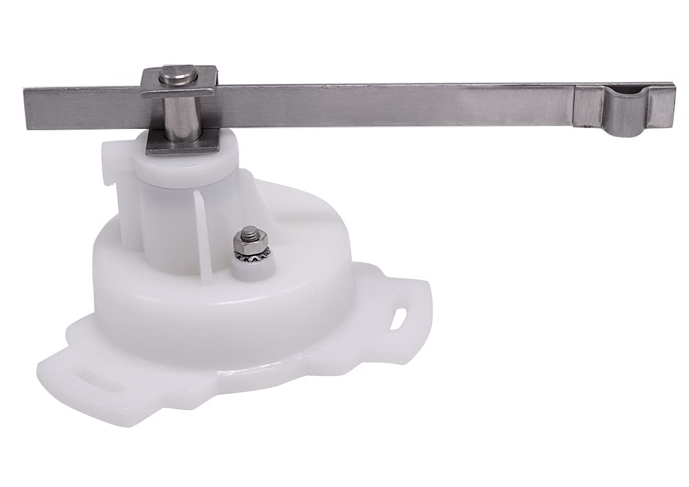

# Rudder Angle Sensor

A complete, working example of using an inexpensive resistive rudder angle sensor to get `steering.rudderAngle` values into SignalK.

See the signalk [spec for /vessels/<RegExp>/steering/rudderAngle](https://signalk.org/specification/1.7.0/doc/vesselsBranch.html#vesselsregexpsteeringrudderangle)).

Simple, common sensors might look like this:

Code from these files could potentially be folded back into the main SensESP project:
* [src/linear.h](src/linear.h) 
* [src/radians.h](src/radians.h)

`linear.h` just contains a convenience method to get an instance of `sensesp::Linear` transform (which is defined using slope intercept format, `f(x) = mx + b`), by deriving that from two points.  The points could anywhere on the line mark start and end range for the transform (i.e. `x1, y1` -> `x2, y2`, or in English "Get a linear transform where resistance value 2.11 Ohms maps to angle value -50 degrees, and 223 Ohms maps to +50 degrees")

`radians.h` is simply a `sensesp::LambdaTransform` to convert from degrees to readians (signalk spec uses radians).

# SensESP Project Template

This project was generated using the template for [SensESP](https://github.com/SignalK/SensESP/) projects. A living example adapted for S/V Symphony's aft sensesp unit lives at [Dark-Star-LLC/symphony-sensesp-aft](https://github.com/Dark-Star-LLC/symphony-sensesp-aft)

Comprehensive documentation for SensESP, including how to get started with your own project, is available at the [SensESP documentation site](https://signalk.org/SensESP/).